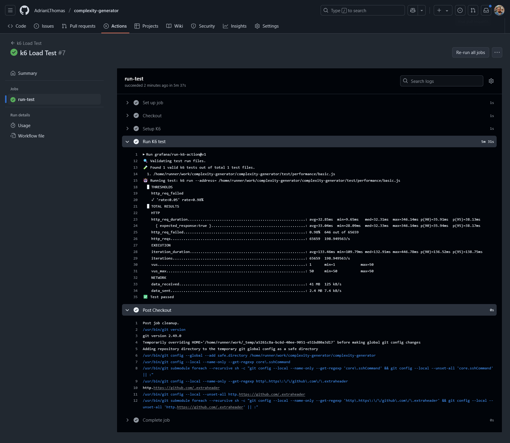

<!-- 
    footer: hello@adrian-thomas.com
-->

<style scoped>
img {
    display: block;
    margin-left: auto;
    margin-right: auto;
}
</style>

# Load Testing With K6

### Adrian L Thomas, MEng


---

<!-- paginate: true -->

# Who?

- Generalist Software Engineer ~13 years professional experience
- Had a bunch of roles: SWE, Team Lead, Staff Engineer...
- Worked across a bunch of technologies (too many to list!)
- Talk to me in the pub about: cars, running, pizza, or any of the above..

---

Disclaimer: I am not representing any company. This talk is based on my own personal experiences and all views are my own only.

---

# What You Will Learn

- What performance testing is
- Why performance test
- K6: What it is, what you can do with it, getting up and running...
  - Free, and open source load testing tool (by Grafana Labs)
- Some anecdotes
- Some gotchas

_Time for questions at the end - or grab me in the pub after_

---

# You Won't Learn

- K6 Browser
- Grafana Cloud
- Distributed tests
- Synthetic monitoring
- gRPC
- ( but hopefully that gives you a taste of the feature-set! )

---

# Who Is This Talk For?

Mainly focused towards engineers and engineering leaders.

e.g. those who may be launching a new service soon, or, wish to retrospectively load test their service (before your users do it for you!).

---

# What Is a Load Test?

- It's literally a test that puts network load on your system
- Like any other test (e.g. a unit test), you define your expectations and assert whether the result is acceptable
- There's a few different types of load test...

---

# Types of Load Tests

<style scoped>
p {
  font-size: 0.5em;
}
</style>

*Source: https://grafana.com/docs/k6/latest/testing-guides/test-types/*

---

# Why Load Test?

- Perhaps about to launch a new service
- Or expecting a significant jump in traffic for an event
- Maybe you're expecting a slow and gentle increase...
- Or you just want to ensure no performance regressions are introduced

---

# Load Testing Use Cases

- Whatever the reason, it helps you understand:
    - how far your current implementation will take you
    - where the system bends
    - what your scaling challenges may be

---


*Anecdote: Pre go-live (CPU Throttling)*

<!-- 

1. Worked on a team that owned a service that was operating as expected

2. 1st basic load test: unravelled a throttling issue

3. Scaling out was fine, requests were responding slowly

4. Investigated: spotted bad K8S config

5. Was common config across the organization, impacted most other services in the org too

6. K8S cluster had capacity to support this burst performance, but due to the CPU limits in place, it was throttled.

7. 1-2 line YAML change: significant performance improvement

Just getting started already delivered value.
-->

---

# K6 - Execution Engine

- K6 itself is written in Go
- Test scripts in Javascript
- Uses Sobek (an engine to execute JS in Go)
- i.e. simulating 10 users testing your website === 10 instances of Sobek running your JS script at a time

*https://grafana.com/docs/k6/latest/reference/glossary/#sobek*
> 

---

# Quickstart: Installing

```sh
brew install k6 # macos
choco install k6 # windows
snap install k6 # ubuntu
```

---

# Quickstart: What Does a Simple Test Script Look Like?

```javascript
import http from 'k6/http';
import { sleep } from 'k6';

export const options = {
  iterations: 10,
};

export default function () {
  http.get('https://quickpizza.grafana.com');

  sleep(1);
}
```

Any guesses for how long this test takes to execute?

*Source: https://grafana.com/docs/k6/latest/get-started/write-your-first-test/*

<!-- 
Review: each line

Note: no "await" on the get!

No VUs configured, so just one user.

Function called 10 times, sleeps 1 second each time. 

Total test time is ~10 seconds.

If we had 10 VUs then it would spend those 10 iterations sooner (so execution would be ~1s)

K6 can do a lot, but it doesn't need to be complicated.
-->

---

# Quickstart: Running a Test

```sh
k6 run script.js
```

---

# Quickstart: Test Output

```

         /\      Grafana   /‾‾/  
    /\  /  \     |\  __   /  /   
   /  \/    \    | |/ /  /   ‾‾\ 
  /          \   |   (  |  (‾)  |
 / __________ \  |_|\_\  \_____/ 

     execution: local
        script: scripts/simple-example.js
        output: -

     scenarios: (100.00%) 1 scenario, 1 max VUs, 10m30s max duration (incl. graceful stop):
              * default: 10 iterations shared among 1 VUs (maxDuration: 10m0s, gracefulStop: 30s)


  █ TOTAL RESULTS 

    HTTP
    http_req_duration.......................................................: avg=106.66ms min=100.36ms med=107.64ms max=114.69ms p(90)=111.55ms p(95)=113.12ms
      { expected_response:true }............................................: avg=106.66ms min=100.36ms med=107.64ms max=114.69ms p(90)=111.55ms p(95)=113.12ms
    http_req_failed.........................................................: 0.00%  0 out of 10
    http_reqs...............................................................: 10     0.878629/s

    EXECUTION
    iteration_duration......................................................: avg=1.13s    min=1.1s     med=1.1s     max=1.37s    p(90)=1.16s    p(95)=1.26s   
    iterations..............................................................: 10     0.878629/s
    vus.....................................................................: 1      min=1       max=1
    vus_max.................................................................: 1      min=1       max=1

    NETWORK
    data_received...........................................................: 32 kB  2.8 kB/s
    data_sent...............................................................: 1.0 kB 92 B/s


running (00m11.4s), 0/1 VUs, 10 complete and 0 interrupted iterations
```

<!-- 
Note:
    http_req_dur
    http_req_failed

    execution time (bottom)
 -->

---

# Core Concepts - Virtual Users (VUs)
- VUs just represent a user hitting your endpoint
- If you have 10 VUs then you have 10 users running the script at once
- Or, 10 instances of your test script running at once

---

# Core Concepts - Virtual Users (VUs)

```javascript
import http from 'k6/http';
import { sleep } from 'k6';

export const options = {
  vus: 10,
};

export default function () {
  http.get('https://quickpizza.grafana.com');

  sleep(1);
}
```

---

# Core Concepts - Test Lifecycle

```javascript
// 1. init code - e.g. imports

export function setup() {
  // 2. setup code, OPTIONAL, e.g. prepare test data for the user
}

export default function (data) {
  // 3. VU code, REQUIRED, your test - e.g. hit endpoint with some data
}

export function teardown(data) {
  // 4. teardown code, OPTIONAL, e.g. clean up data
}
```

---

# Core Concepts - Checks & Thresholds

## Checks

- Boolean condition, e.g. status should be 200 or body should include a string
- Just a metric to report

```javascript
import { check } from 'k6';
import http from 'k6/http';

export default function () {
  const res = http.get('http://test.k6.io/');
  check(res, {
    'is status 200': (r) => r.status === 200,
    'verify homepage text': (r) => r.body.includes('Collection of simple web-pages suitable for load testing'),
  });
}
```

**A failing check does NOT equate to a failing test.**

<!-- If you want a CHECK to fail, it must be combined with a THRESHOLD -->

---

# Core Concepts - Checks & Thresholds

## Thresholds

<!-- 

SLO's you'd like to report on

-->

```javascript
import http from 'k6/http';

export const options = {
  thresholds: {
    http_req_failed: ['rate<0.01'], // http errors should be less than 1%
    http_req_duration: ['p(95)<200'], // 95% of requests should be below 200ms
  },
};

export default function () {
  http.get('https://quickpizza.grafana.com');
}
```

**A failing threshold DOES equate to a failing test**. It will return a non-zero exit code.

<!-- Exit code is helpful particularly in CI to fail the build -->

<!-- Can combine checks with thresholds. -->

<!-- TODO - show example in code of threshold / check -->

---

# Metric Reporting

- K6 reports some metrics in the CLI output, it's likely that you will want to track these over time.

- If you're already tracking your service metrics (e.g. AWS Cloudwatch, New Relic, etc), then great.

- Otherwise you might want to look at integrating that to monitor and alert over time (out of scope for this talk!).

*Warning*: The metrics K6 output will probably be different than your metrics platform (client reporting vs server reporting).

---

# Metrics to Investigate

If there's an issue, you'll probably want to keep an eye on:
- P95 response duration
- Error rate

If you spot issues, you'll likely want to check your service:
- Is scaling (up / out)
- CPU utilization
- RAM utilization
- DB load
- etc

---

# Live Demo: Running K6 Locally

<!-- 
Show K6 script and execute it - view CLI output.

Show: Threshold is 95% of checks should pass, as service only errors 1% only of the time.
 -->

---

# Preparing a Test Environment

- Might be the most time consuming part of setup
- Test scripts themselves can be simple
- You will probably need to setup test data (e.g. in your database, CMS, etc) to simulate typical responses of your customers

---

# Preparing a Test Environment
## High level setup

- For example, you may need to setup things like:
  - Test accounts
  - API keys
  - Scripts to generate and insert test data
  - _This may be manual or automated depending on the maturity of the org_

- Add to config file (not secrets) and load from tests

<!--
If setting up a few test accounts manually is 30 minutes

Do that... it might be much quicker than automating it all!

-->

---

# Preparing a Test Environment
## Test Scenarios - What to Test?

What do you want to test?
- Frequently hit endpoints?
- Complex endpoints?
- Read-only?
  - If writing, probably additional work to clean up data too
- _Gotcha_: Caution, load testing against a CDN...

<!-- 
Complex: computationally heavy, complex DB queries?


Do you really want to test the CDN? what's the point? youy might get blocked, and you're not testing your origin properly

-->

---

# Preparing a Test Environment
## Test Scenarios - How to Test?

How do you want to simulate it?
- Aforementioned load test types
- e.g. for stress test: maybe try 10x the traffic you anticipate

<!-- 

Writing: clean up to avoid impacting subsequent test runs
 -->

---

# Preparing a Test Environment
## Data Setup

- If storing customer data, you'll probably want to preload test data
- e.g. writing some scripts to insert test data

---

# Preparing a Test Environment
## The Infrastructure

- A suitable environment to test **against** 
  - ideally identical to production, but **not** production, e.g. staging
<!-- 
  So customers aren't using it and you're not impacting their experience.
 -->

- A suitable environment to test **from** 
  - ideally dedicated / not used for other workloads, e.g. self hosted runner or K6 cloud
<!--  
  You don't want other people's workloads / noise impacting your tests.

  - Bad example: Cloud hosted runner - as it could be running anything, you're at their mercy.
-->

---

# Running the Tests Regularly

- You'll probably want to run the tests regularly in CI
  - Enables you to test for regressions
  - At least once a day (e.g. nightly cron)
  - Execute for a reasonable duration
  - *Gotcha*: Allow time for warm up!

- Don't stress test everything on every push - it's too heavy
  - _But: K6 can be used for lightweight smoke tests too_
- But don't test too irregularly that the results end up ignored

<!-- 
  Long execution time = heavy on the environment, and if it was every push you'd be waiting forever for your build to complete.

  You can use stages for warm up. If you don't warm up you might not scale quick enough!
  Obviously depends on the customer traffic patterns.
  TODO - provide an example if time.
-->

---

# Example GHA Snippet
<!-- View an example: https://github.com/AdrianLThomas/complexity-generator/actions/runs/14473130468/job/40592000591 


See: 47 RPs - same as K6 output
but..... p95 is different.
-->

<style scoped>
marp-pre {
  font-size: 0.7rem;
}
</style>

```yaml
name: k6 Load Test

on:
  schedule:
    - cron: '0 0 * * *' # every day at 00:00 UTC
  workflow_dispatch: # trigger via UI on demand

jobs:
  run-test:
    runs-on: ubuntu-latest
    steps:
      - name: Checkout
        uses: actions/checkout@v4

      - name: Setup K6
        uses: grafana/setup-k6-action@v1

      - name: Run K6 test
        uses: grafana/run-k6-action@v1
        with:
          path: test/performance/basic.js
```

---

# Live Demo: Running in CI & Observing The Results

<!-- 
Show K6 output in GHA
Show Cloudflare output

Gotcha: K6 vs Cloudflare reporting of response times (client vs server reporting)

 -->

---

_In case of demo demons_

*View fullscreen: Right Click > Open image in new tab*




<!-- Note in particular:
- P99
- Requests Per Second
- Errors
- CPU time -->

---

# FIN!
## Summary
- Importance of load testing, what it can do for you
- Crash course in K6
- Some practical guidance and anecdotes


## Resources
- [grafana.com/docs/k6/latest](https://grafana.com/docs/k6/latest/)
- [adrian-thomas.com/presentations](https://adrian-thomas.com/presentations)
- [github.com/AdrianLThomas/complexity-generator](https://github.com/AdrianLThomas/complexity-generator)
  <!-- 
    Repo contains: Basic API, Also the GitHub Action for running K6
  -->

---

*Anecdote: Bad dependabot update*

<!-- Context: Once our tests were running nightly in CI, and things were stable. One morning, we spotted a performance drop. Git bisecting the issue and re-running the load tests helped me identify the issue, which was also impacting a bunch of other services and teams across the organization. It was a minor OTEL update dependabot introduced! -->

TODO - where does this fit?


---
*Anecdote: Residual Sidecar Impacting Scaling*

TODO - where does this fit?

---

<!-- 
ENHANCEMENTS

TODO
- Content
  - Anything missed?
  - AI sanity check / critique
  - Check final TODOs
  - Look at config in GHA again if time.
- Timings
  - Trial run: does it all fit?
  - Mark candidates for skipping if time required
- Styling
  - Improvements / Marp theme?

 -->