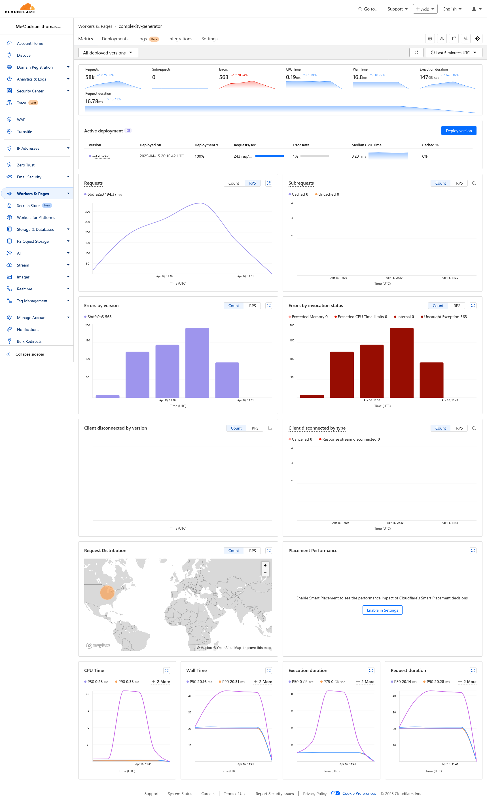

# DRAFT

These slides are **IN PROGRESS**. If you're reading this, they probably don't quite make sense yet as I've not finished!

Continue at your own risk...


---

<!-- 
    footer: hello@adrian-thomas.com
-->

<style scoped>
img {
    display: block;
    margin-left: auto;
    margin-right: auto;
}
</style>

# Load Testing With K6

### Adrian L Thomas, MEng


---

<!-- paginate: true -->

# Who?

- Generalist Software Engineer ~13 years professional experience
- Had a bunch of roles: SWE, Team Lead, Staff Engineer...
- Worked across a bunch of technologies (too many to list!)
- Talk to me in the pub about: cars, running, pizza, or any of the above..

---

Disclaimer: I am not representing any company. This talk is based on my own personal experiences and all views are my own only.

---

# What You Will Learn

- What performance testing is
- Why performance test
- K6: What it is, what you can do with it, getting up and running...
- Some anecdotes
- Gotchas & best practices

---

# You Won't Learn

- K6 Browser
- Grafana Cloud
- Distributed tests
- Synthetic monitoring
- gRPC
- ( but hopefully that gives you a taste of the feature-set! )

---

# Who Is This Talk For?

Mainly focused towards engineers and leaders.

e.g. those who may be launching a new service soon, or, wish to retrospectively load test their service (before your users do it for you!).

---

# What Is a Load Test?

- It's literally a test that puts network load on your system
- Usually simulating traffic beyond that you are expecting to receive, and observe whether the system will cope

---

# Types of Load Tests

<style scoped>
p {
  font-size: 0.5em;
}
</style>

*Source: https://grafana.com/docs/k6/latest/testing-guides/test-types/*

---

# Why Load Test?

- Perhaps about to launch a new service
- Or expecting a significant jump in traffic for an event
- Maybe you're expecting a slow and gentle increase...
- Or you just want to ensure no performance regressions are introduced

---

# Load Testing Use Cases

- Whatever the reason, it helps you understand:
    - how far your current implementation will take you
    - where the system bends
    - what your scaling challenges may be

---


*Anecdote: Pre go-live (CPU Throttling)*

<!-- 
  Before I start digging in to the code:  I want to give a little anecdote.

  I worked on a team with a service that was operating normally under our manual and automated testing (integration tests) on staging. 

  When we introduced the load test, almost immediately we unravelled a throttling issue. After some inspection we noticed that the K8S configuration that plagued not only our service but other services too, meant even though the K8S cluster had CPU capacity to handle the additional load, AND our service scaled out, our service would still be throttled and perform poorly. 

  So even just getting started was worthwhile! and I'll be mention some of the other benefits discovered as we get more involved.
-->

---

# This Talk

- I'll be talking about K6 (https://k6.io)
- It's a free, and open source load testing tool (by Grafana Labs)
- There are other tools out there

_Time for questions at the end - or grab me in the pub after_

<!-- I'll be talking about the free, open source product, not the cloud offering -->

---

# K6 - Execution Engine

- K6 itself is written in Go
- Test scripts in Javascript
- Uses Sobek (an engine to execute JS in Go)
- i.e. simulating 10 users testing your website === 10 instances of Sobek running your JS script at a time

*https://grafana.com/docs/k6/latest/reference/glossary/#sobek*
> 

---

# Quickstart: Installing

```sh
brew install k6 # macos
choco install k6 # windows
snap install k6 # ubuntu
```

---

# Quickstart: What Does a Simple Test Script Look Like?

<!-- Consider: Skipping the next slides in favour of a live demo. -->

```javascript
import http from 'k6/http';
import { sleep } from 'k6';

export const options = {
  iterations: 10,
};

export default function () {
  http.get('https://quickpizza.grafana.com');

  sleep(1);
}
```

Any guesses for how long this test takes to execute?

*Source: https://grafana.com/docs/k6/latest/get-started/write-your-first-test/*

<!-- 

Explain each line (imports, iterations, how the func gets called)

Note: no "await" on the get!

No VUs configured, so just one user.

Function is called 10 times, but sleeps 1 second each time. So the total test time is ~10 seconds.

If we had 10 VUs then it would spend those 10 iterations sooner (so execution would be ~1s)

K6 can do so much, but it doesn't need to be complicated.


-->

---

# Quickstart: Running a Test

```sh
k6 run script.js
```

---

# Quickstart: Test Output

```

         /\      Grafana   /‾‾/  
    /\  /  \     |\  __   /  /   
   /  \/    \    | |/ /  /   ‾‾\ 
  /          \   |   (  |  (‾)  |
 / __________ \  |_|\_\  \_____/ 

     execution: local
        script: scripts/simple-example.js
        output: -

     scenarios: (100.00%) 1 scenario, 1 max VUs, 10m30s max duration (incl. graceful stop):
              * default: 10 iterations shared among 1 VUs (maxDuration: 10m0s, gracefulStop: 30s)


  █ TOTAL RESULTS 

    HTTP
    http_req_duration.......................................................: avg=106.66ms min=100.36ms med=107.64ms max=114.69ms p(90)=111.55ms p(95)=113.12ms
      { expected_response:true }............................................: avg=106.66ms min=100.36ms med=107.64ms max=114.69ms p(90)=111.55ms p(95)=113.12ms
    http_req_failed.........................................................: 0.00%  0 out of 10
    http_reqs...............................................................: 10     0.878629/s

    EXECUTION
    iteration_duration......................................................: avg=1.13s    min=1.1s     med=1.1s     max=1.37s    p(90)=1.16s    p(95)=1.26s   
    iterations..............................................................: 10     0.878629/s
    vus.....................................................................: 1      min=1       max=1
    vus_max.................................................................: 1      min=1       max=1

    NETWORK
    data_received...........................................................: 32 kB  2.8 kB/s
    data_sent...............................................................: 1.0 kB 92 B/s


running (00m11.4s), 0/1 VUs, 10 complete and 0 interrupted iterations
```

<!-- 
Note: A few things going on. 

Notable: 
    http_req_dur
    http_req_failed

    runtime at bottom
 -->

---

# Core Concepts - Virtual Users (VUs)
- VUs just represent a user hitting your endpoint
- If you have 10 VUs then you have 10 users running the script at once
- Or, 10 instances of your test script running at once

---

# Core Concepts - Virtual Users (VUs)

```javascript
import http from 'k6/http';
import { sleep } from 'k6';

export const options = {
  vus: 10,
};

export default function () {
  http.get('https://quickpizza.grafana.com');

  sleep(1);
}
```

---

# Core Concepts - Test Lifecycle

```javascript
// 1. init code - e.g. imports

export function setup() {
  // 2. setup code, OPTIONAL, e.g. prepare test data for the user
}

export default function (data) {
  // 3. VU code, REQUIRED, your test - e.g. hit endpoint with some data
}

export function teardown(data) {
  // 4. teardown code, OPTIONAL, e.g. clean up data
}
```

---

# Core Concepts - Checks & Thresholds

## Checks

- Boolean condition, e.g. status should be 200 or body should include a string
- Just a metric to report

```javascript
import { check } from 'k6';
import http from 'k6/http';

export default function () {
  const res = http.get('http://test.k6.io/');
  check(res, {
    'is status 200': (r) => r.status === 200,
    'verify homepage text': (r) => r.body.includes('Collection of simple web-pages suitable for load testing'),
  });
}
```

**A failing check does NOT equate to a failing test.**

<!-- If you want a check to fail, it must be combined with a ..... threshold (next slide) -->

---

# Core Concepts - Checks & Thresholds

## Thresholds

<!-- - Typically SLO's you'd like to report on, e.g. <1% of requests should error
- or 95% of requests should be below 200ms -->

```javascript
import http from 'k6/http';

export const options = {
  thresholds: {
    http_req_failed: ['rate<0.01'], // http errors should be less than 1%
    http_req_duration: ['p(95)<200'], // 95% of requests should be below 200ms
  },
};

export default function () {
  http.get('https://quickpizza.grafana.com');
}
```

**A failing threshold DOES equate to a failing test**. It will return a non-zero exit code.

<!-- You can also combine custom checks with thresholds. -->

---

# Metric Reporting

- K6 reports some metrics in the CLI output, it's likely that you will want to track these over time.

- If you're already tracking your service metrics (e.g. AWS Cloudwatch, New Relic, etc), then great.

- Otherwise you might want to look at integrating that to monitor and alert over time (out of scope for this talk!).

*Warning*: The metrics K6 output will probably be different than your metrics platform (client reporting vs server reporting).

---

# Metrics to Investigate

If there's an issue, you'll probably want to keep an eye on:
- P95 response duration
- Error rate

If you spot issues, you'll likely want to check your service:
- Is scaling (up / out)
- CPU utilization
- RAM utilization
- DB load
- etc

<!-- It's important to have visibility of that too -->

---

# Live Walkthrough and Demo

<!-- 
  Show some code of a simple service and API test

  Take a look at some graphs in Cloudflare

  Backup screenshot: `images/cloudflare-workers-dashboard.png` 

  Demonstrate:
  - Threshold is 95% of checks should pass, as service only errors 1% only of the time.
 -->

---

_In case of demo demons_

*View fullscreen: Right Click > Open image in new tab*



TODO - update screenshot with a fresh test run - maybe over 5 minutes?

Note in particular:
- P99
- Requests Per Second
- Errors
- CPU time

---

# Preparing a Test Environment

- This could be the most time consuming part of getting setup, depending on what you're testing
- As you've seen, the test scripts themselves can be quite simple
- Hitting a service that doesn't respond with anything might not be a very relevant test
- You will probably want to setup test data (e.g. in your database, CMS, etc) that models something similar to your customers

---

# Preparing a Test Environment
## High level setup

- In my situation it involved some CMS setup:
  - Test organizations (manual)
  - API keys (manual)
  - Scripts to generate and insert data (semi manual)
  - Take all the above and add to a configuration file, for reusability in testing
  - A balance to be made between manual setup and automation
<!--
  Our tests were read heavy, so we didn't need to tear down the environment.
    
  If we did need to tear down then automation would have been **crucial**
-->

---

# Preparing a Test Environment
## Scenarios to Test

- Need to think about the scenarios you'd like to test
  - Perhaps most taxing endpoint (complex JOINs? or computationally heavy?)
  - Endpoints you anticipate being hit the hardest
  - Read-only? What about writes?
    - Writes complicate things further: ideally the tests will be idempotent, and data mutation means you may need to clean up data too (to avoid impacting subsequent tests)
  - Do you know how much traffic you are expecting? multiply it by 10 (early warning system!)

---

# Preparing a Test Environment
## Data Setup

- If customers can store data with you, you'll probably want to preload it before testing

---

# Preparing a Test Environment
## The Infrastructure

- A suitable environment to test **against** 
  - ideally identical to production, but **not** production, e.g. staging
<!-- 
  So customers aren't using it and you're not impacting their experience.
 -->

- A suitable environment to test **from** 
  - ideally dedicated / not used for other workloads, e.g. self hosted runner
<!--  
  You don't want other people's workloads / noise impacting your tests.

  - Bad example: Cloud hosted runner - as it could be running anything, you're at their mercy.
-->

---

# Getting Set Up in CI
- Depending on the complexity of your tests, you might not want to run _all_ of them regularly (e.g. hours of execution)
- Sanity checking the health of your endpoints for 10 minutes or so should give you a good indication

# CI Frequency
- Ideally every night (cron / nightly pipeline)
- You might decide to do it more regularly: but caution should be applied.. you may disrupt your colleagues (if a shared environment) / or it may be expensive!

TODO show example GHA snippet

---

# Example Output & Metrics
<!-- (skip time depending) -->
- Maybe show the output in GHA
- Failing build the build - and alerting 
    - Caveat: P95 between K6 output and external metrics may be different (but should be similar)
- Show a nice P95/P99 graph? maybe Cloudflare gives us something out of the box?

FAQ: What's good/bad? A: it depends on your own definition and SLA's defined.

---

# Gotchas
<!-- (to look out for) -->
- Load tests running against a CDN
- Warm up time (to scale) in tests
- Response times reported by K6 may be slightly different to those reported by your monitoring system.

# Best Practices / Advanced (skip time depending)
- Write tests scripts to be reusable: make use of env vars (so you can run them locally or in other environments)
- Try to simulate existing traffic patterns - e.g. if distribute the load between endpoints that are hit frequently and less frequently in production with real traffic.
    - FAQ: you can do this by looking at your existing observability data.

--- 

# FIN
## Summary
- TODO: Summarise key points


## Resources
- [grafana.com/docs/k6/latest](https://grafana.com/docs/k6/latest/)
- [adrian-thomas.com/presentations](https://adrian-thomas.com/presentations)
- [github.com/AdrianLThomas/complexity-generator](https://github.com/AdrianLThomas/complexity-generator)

# Any Questions?

---

*Anecdote: Bad dependabot update*

<!-- Context: Once our tests were running nightly in CI, and things were stable. One morning, we spotted a performance drop. Git bisecting the issue and re-running the load tests helped me identify the issue, which was also impacting a bunch of other services and teams across the organization. It was a minor OTEL update dependabot introduced! -->

TODO - where does this fit?


---
*Anecdote: Residual Sidecar Impacting Scaling*

TODO - where does this fit?


---

TODO
- Content
  - Anything missed?
  - AI sanity check / critique
- Timings
  - Trial run: does it all fit?
  - Mark candidates for skipping if time required
- Styling
  - Improvements / Marp theme?